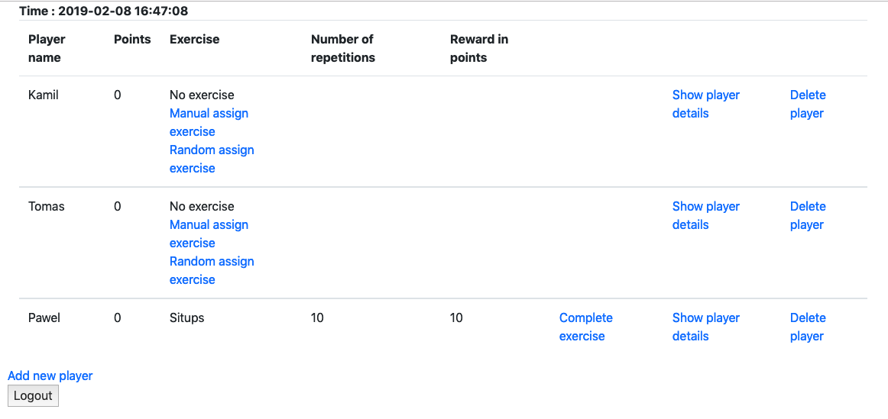
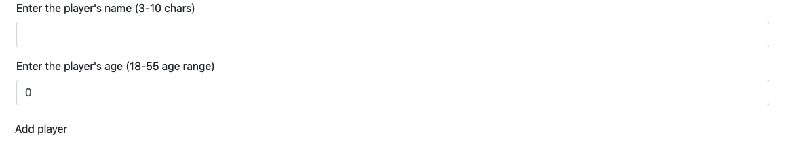
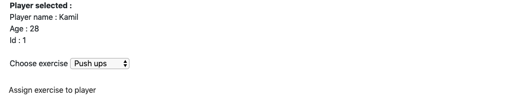
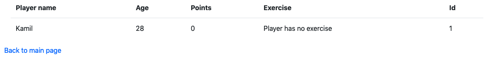

# GameTrainingChallenge
GameTrainingChallenge is a simple web application (game) using spring and h2 database in which you can play with friends

## Table of contents
* [General info](#general-info)
* [How to start](#How-to-start)
* [Screenshots](#screenshots)
* [Technologies](#technologies)
* [Status](#status)
* [Contact](#contact)

## General info
I decided to created this application to expand my knowledge on Spring (Starter/Web/Security)

## How to start
To run application You have to start main method i GameTrainingChallenge class
path: GameTrainingChallenge/src/main/java/com/GameTrainingChallenge/GameTraningChallenge.java

login - password

user1 - pass1 (can everything except see details of player)

user2 - pass2 (can everything)

Default users and passwords is declared in Starter class
path: GameTrainingChallenge/src/main/java/com/GameTrainingChallenge/Starter.java

## Screenshots
Main page with all users on which u can add/remove players, randomly assign an exercise to player,
finish the exercise or go to page with player details or page with manual assign exercise to selected player

Page on which you can add players

Page on which you can manual select exercise to player

Page on which you can see details of selected player

## Technologies
* Java 8
* Maven
* Spring Boot/Starter/MVC/Data/Security
* Hibernate
* H2 Database
* Jquery
* Bootstrap
* Thymeleaf
* Gitflow

## Status
Project is: _finished_

## Contact
Created by [@Kamil_Zajac](https://www.linkedin.com/in/kamil-zaj%C4%85c-39a350119/) - feel free to contact me!
